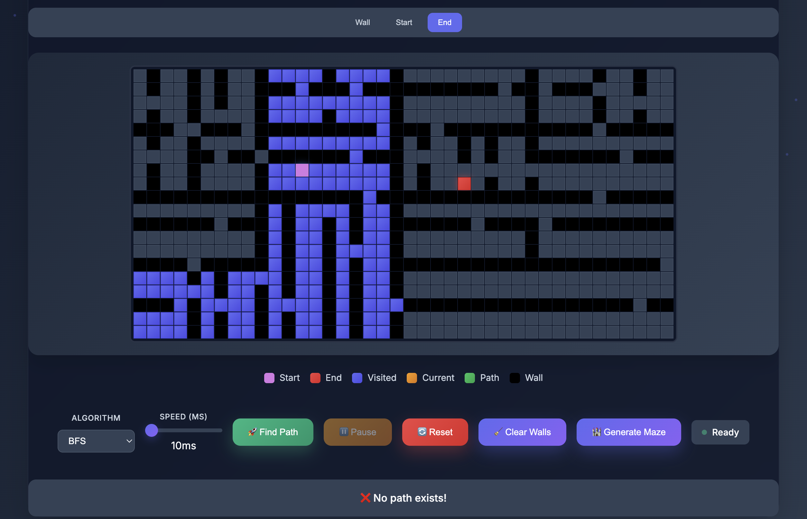
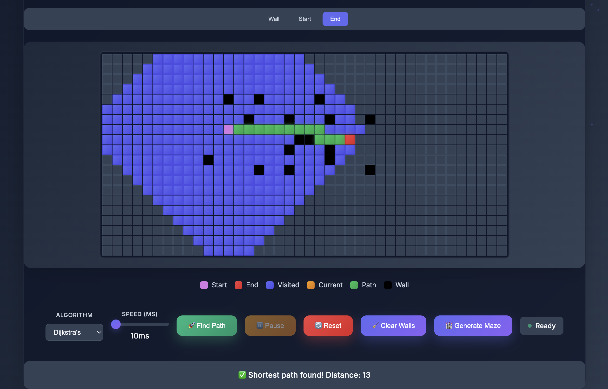

# Sort-a-Path

Screenshots

  
  
  

Overview
Sort-a-Path is an interactive web application built with React and JSX, designed to visualize sorting algorithms and grid-based pathfinding algorithms. It provides a user-friendly interface to explore algorithms like Bubble Sort, Selection Sort, Insertion Sort, Quick Sort, Dijkstra's Algorithm, A* Search, BFS, and DFS. The application features real-time animations, customizable settings, and detailed statistics to enhance understanding of algorithmic processes.
Features

Sorting Visualizer:

Supports Bubble Sort, Selection Sort, Insertion Sort, and Quick Sort.
Visualizes array elements as bars with dynamic colors indicating states (unsorted, comparing, swapping, sorted).
Adjustable array size and animation speed.
Displays real-time statistics for comparisons, swaps, time complexity, and space complexity.

Pathfinding Visualizer:

Supports Dijkstra's Algorithm, A* Search, BFS, and DFS.
Interactive grid for setting start/end nodes and walls.
Features maze generation and wall clearing.
Visualizes node states (start, end, visited, current, path, wall) with animations.
Displays nodes visited, path length, time complexity, and space complexity.

Responsive Design:

Glassmorphism-inspired UI with gradient backgrounds and animations.
Mobile-friendly layout with adaptive grid sizes and controls.

Additional Features:

Toggle between sorting and pathfinding visualizers.
Pause, resume, and reset functionality for algorithm execution.
Floating particle animations for aesthetic enhancement.
Help section with usage instructions.

Tech Stack

Frontend: React 18.2.0, JSX
Styling: CSS with custom properties, gradients, and glassmorphism effects
Dependencies:
React and ReactDOM (via CDN)
Babel for JSX transpilation
Google Fonts (Inter)

Canvas: Used for rendering the sorting visualizer
No backend: Purely client-side application

Run the Application:

Open the index.html file in a browser.
The application will automatically render with the sorting visualizer as the default view.

Sorting Visualizer:

Choose Algorithm: Select from Bubble Sort, Selection Sort, Insertion Sort, or Quick Sort.
Adjust Settings:
Use the "Array Size" slider (10–100) to change the number of elements.
Use the "Speed" slider (10–500 ms) to adjust animation speed.

Controls:
Generate Array: Create a new random array.
Start/Resume: Run or resume the sorting algorithm.
Pause: Pause the animation.
Reset: Generate a new array and reset statistics.

Statistics: Monitor comparisons, swaps, and complexities in real-time.

Pathfinding Visualizer:

Set Grid:
Select "Start" mode to place the start node.
Select "End" mode to place the end node.
Select "Wall" mode to toggle walls on the grid.

Choose Algorithm: Select from Dijkstra's, A* Search, BFS, or DFS.
Adjust Speed: Use the speed slider (10–500 ms) to control animation speed.
Controls:
Find Path: Start or resume the pathfinding algorithm.
Pause: Pause the animation.
Reset: Clear the grid and reset states.
Clear Walls: Remove all walls, keeping start/end nodes.
Generate Maze: Create a random maze using recursive division.

Statistics: View nodes visited, path length, and complexities.

Navigation:

The "How to Use" section at the bottom provides detailed instructions for each visualizer.

